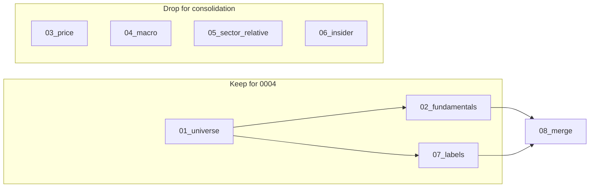

# Pipeline consolidation for experiment 0004

This document specifies how to consolidate the pipeline so that a single script generates the dataset needed to run experiment 0004, with minimal features and month-end-only rows, while preserving event handling to avoid survivorship bias.

---

## 1. Purpose

- **Validate** the pipeline against one experiment (0004) before adding FRED and other feature sets.
- Produce a **single script** that builds the 0004 dataset: month-end rebalance dates only, with only the features and labels 0004 uses.
- **Event handling** remains as implemented in `01_universe.py` and `07_labels.py`; the consolidated flow consumes their outputs and does not reimplement labels or terminal-event logic.

---

## 2. What 0004 needs

Experiment 0004 (and `experiments/select_0004.py`) use the following columns:

| Source        | Columns | Purpose |
|---------------|---------|---------|
| Universe      | `date`, `ticker`, `sector`, `marketcap_daily` | Rebalance date, identity, sector exclusion (Financial Services, Real Estate), cap filter / top-N. |
| Fundamentals  | `pcf_pit`, `fcf_r2_10y`, `fcf_pct_positive`   | Ranking (PCF), quality filters. |
| Labels        | `fwd_ret_21td`, `fwd_holding_days_21td`, `fwd_delisted_21td` | Forward return and event handling (delist within horizon). |
| VIX           | Optional | `require_vix=False` allows null VIX; minimal pipeline omits macro so VIX can be null. |

**Consolidated output schema:**  
`date`, `ticker`, `sector`, `marketcap_daily`, `pcf_pit`, `fcf_r2_10y`, `fcf_pct_positive`, `vix` (NULL), `fwd_ret_21td`, `fwd_holding_days_21td`, `fwd_delisted_21td`.  
Experiment 0004 calls the selector with `require_vix=False` so rows are included when using this dataset.

---

## 3. Current pipeline (what we keep vs drop)

**Kept for 0004:**

- **01_universe** — Builds `outputs/universe/daily_universe.parquet` (ticker, date, sector, famaindustry, marketcap_daily, in_universe, etc.). Event logic (terminal events, mergerfrom exclusion) determines who is in the universe when; this feeds both universe membership and the grid used by labels.
- **02_fundamentals** — Builds `outputs/features/fundamental_pit.parquet`; uses `pipeline/fundamental_quality.py` for `fcf_r2_10y`, `fcf_pct_positive`; outputs `pcf_pit` and the rest of the fundamental schema. The consolidated script reads only the columns 0004 needs.
- **07_labels** — Builds `outputs/labels/forward_labels.parquet` from the universe grid plus SEP and ACTIONS. Implements trading-day horizons (e.g. 21td), terminal price = last SEP closeadj, and `fwd_delisted_*td` per [Event handling](event_handling.md).

**Dropped for consolidation:**

- **03_price_features** — Not used by 0004.
- **04_macro_features** — Not needed for minimal 0004; VIX can be null.
- **05_sector_relative** — 0004 uses `sector` only for exclusion; sector comes from universe.
- **06_insider_institutional** — Not used by 0004.

**Merge:** The full **08_merge** joins universe, fundamentals, price, macro, sector_relative, insider, and labels for every trading day. The consolidated script performs a **slim merge**: universe (filtered to in_universe and month-end only) + fundamentals subset + labels, and writes only the columns above.



---

## 4. Event handling

Event handling is **unchanged** and lives in:

- **01_universe.py** — Resolved terminal events and `removal_per_ticker` (excluding mergerfrom) determine which (ticker, date) rows exist in the universe. That universe is the grid for labels and the base for the merge.
- **07_labels.py** — Same terminal-event resolution; computes forward returns using terminal price (last SEP closeadj) when a security delists within the horizon; sets `fwd_delisted_*td` and `fwd_delist_type_*td` (mergerfrom excluded from the flag).

See [Event handling: assumptions and event-study learnings](event_handling.md) for the single source of truth.

The consolidated script **does not** reimplement labels or event logic; it runs (or requires) 01 → 02 → 07 and joins their outputs. Survivorship bias is avoided by using these existing artifacts.

---

## 5. Pipeline stages: code we use and justification

This section records which code in each stage the consolidated flow relies on, how point-in-time (PIT) and event handling are satisfied, and why anything we ignore is safe to omit for 0004.

### 5.1 01_universe.py

**What we run:** The full script; we do not reimplement any of it. The build script invokes it (or assumes its output exists) and then reads `daily_universe.parquet`.

**Code we rely on (and why):**

- **Terminal event resolution (lines ~179–230):**  
  `delist_dates` (action = 'delisted'), `delist_reasons` (companion actions: acquisitionby, bankruptcyliquidation, etc.), `resolved_delists_raw` (one row per event with delist_type), `renames_near_delist` (tickerchangefrom within ±5 days).  
  `terminal_events_resolved` excludes renames so we do not treat ticker changes as terminal delists.  
  `removal_per_ticker` = MIN(event_date) per ticker with **mergerfrom excluded** (per [event_handling.md](event_handling.md): mergerfrom date semantics are broken).  
  **Why:** This is the single source of truth for “when did this ticker stop trading.” We need it so the universe and labels agree on who is still in the universe on each date and when to use terminal price.

- **universe_core (lines ~262–276):**  
  `candidate_from_sep` (ticker, date from SEP in range) INNER JOIN TICKERS (firstpricedate / lastpricedate) LEFT JOIN removal_per_ticker, with  
  `WHERE (r.removal_date IS NULL OR r.removal_date > c.date)`.  
  **Why (no survivorship bias):** A ticker stays in the universe on every date **up to and including** the date before removal. We do not drop them before they delist. So on the last trading day we still have a row; 07_labels can compute the forward return using terminal price when they delist within the horizon. Returns therefore reflect actual outcomes (acquisition, bankruptcy, etc.), not survivorship-biased returns.

- **TICKERS filter:** `table = 'SF1'`, firstpricedate ≤ date, lastpricedate ≥ date. Standard listing window; we keep it.

- **daily_universe output:** We use columns `date`, `ticker`, `sector`, `marketcap_daily`, `in_universe`. The build script filters to `in_universe = TRUE` and to month-end dates only.

**What we ignore and why:**

- **fwd_spinoff_60d:** Flag for spinoff in next 60 days. 0004 does not filter or weight on it; omitting it from the 0004 output does not change 0004 results. If a future experiment uses it, the column remains in the universe parquet.
- **days_listed, famaindustry, scalemarketcap:** Not used by 0004 selection; we only need sector (for exclusion) and marketcap_daily (for top-N). Safe to omit from the slim output.

### 5.2 02_fundamentals.py

**What we run:** The full script. It reads the universe as the **grid** (every (ticker, date) from daily_universe) and writes `fundamental_pit.parquet`. The build script then selects only `pcf_pit`, `fcf_r2_10y`, `fcf_pct_positive` from that parquet.

**Code we rely on (and why):**

- **Grid = universe (line ~126):** `grid` is loaded from `daily_universe.parquet`. So we only get fundamentals for (ticker, date) that exist in the event-aware universe. **PIT / survivorship:** Observation set is already correct; we never compute fundamentals for dates after a ticker’s removal.

- **ART path (art_snapshot_combined, lines ~216–240):** ASOF JOIN so that for each (ticker, date) we get the latest ART row with `datekey_date <= g.date`. **PIT:** On each observation date we only see financials that had been filed on or before that date. No look-ahead.

- **Quality metrics (fcf_r2_10y, fcf_pct_positive):** Produced by `compute_quality_metrics_table` in [pipeline/fundamental_quality.py](pipeline/fundamental_quality.py) with vintage-based PIT (datekey ≤ vintage). In 02 they are joined with ASOF JOIN `q.datekey_date <= g.date` (lines ~314–317). **PIT:** For each observation date we get the latest quality metrics filed on or before that date.

- **pcf_pit (lines ~284–285):** `(closeadj * shareswa) / ncfo` using ART at g.date; ART is ASOF so price and financials are aligned in time. **PIT:** Correct.

**What we ignore and why:**

- **All other fundamental columns** (pe_pit, pb_pit, roe, days_since_filing, etc.): 0004 uses only pcf_pit (ranking) and fcf_r2_10y / fcf_pct_positive (quality filter). Those other columns are not used by the selector; omitting them from the consolidated output does not change 0004 backtest results. We still run 02 as-is so the three columns we need are computed with the same PIT and dependencies.

### 5.3 07_labels.py

**What we run:** The full script. It uses the **same universe** as the (ticker, date) grid and writes `forward_labels.parquet`. The build script joins only `fwd_ret_21td`, `fwd_holding_days_21td`, `fwd_delisted_21td`.

**Code we rely on (and why):**

- **Grid = universe (lines ~65–69):** Labels are computed for every (ticker, date) in the universe parquet. So we have labels for the same event-aware set of dates as 01 and 02. **Survivorship:** Delisted names remain in the universe until removal_date; they get a row on their last trading dates, and that row gets a forward return.

- **Terminal event resolution (lines ~104–165):** Same logic as 01: delist_dates, delist_reasons, resolved_delists_raw, renames_near_delist, terminal_events_resolved. **Why:** 07 must know which events are true terminal delists (and which are renames or mergerfrom) so it can set `fwd_delisted_*td` and use terminal price only when appropriate.

- **Forward return with terminal price (lines ~198–278):** For each horizon N, `grid_cur` has current price and trading-day rank; `fwd_N` joins to the N-th forward trading day. If there is no N-th forward day (e.g. delist within N days), `terminal_row` provides the **last available SEP closeadj** for that ticker. Return is either `(price_n / price_t) - 1` or `(term_closeadj / price_t) - 1`. **Why (no survivorship bias):** Per [event_handling.md](event_handling.md), we use last SEP closeadj for all event types (acquisition, bankruptcy, etc.); we do not append a synthetic $0. So forward returns reflect actual investor outcomes. `fwd_delisted_*td` and `fwd_delist_type_*td` are set from terminal_events_resolved with **mergerfrom excluded from the flag** so we do not mark mergerfrom as a terminal delist (ticker recycling).

- **fwd_holding_days:** When we use terminal price, we store the actual number of trading days held (e.g. term_rn - rn_t). So holding period is correct for partial horizons.

**What we ignore and why:**

- **Other horizons (5td, 10td, 63td, 126td, 252td):** 0004 uses only the 21td horizon. We do not write the other horizons to the slim output; 0004 behavior is unchanged. The full forward_labels.parquet still contains them if another experiment needs them.

### 5.4 Build script (slim merge)

**What we do:** Filter universe to `in_universe = TRUE` and to **month-end dates only** (last trading day of each month). Join universe → fundamentals (three columns) → labels (21td columns). Write one parquet with the 10 columns 0004 needs (plus null vix).

**PIT and event handling:** We do not change any logic in 01, 02, or 07. We only **subset rows** to rebalance dates. 01 still produces the full daily universe; 07 still produces labels for the full grid, so labels on month-end dates are already correct (same event handling, same terminal price). We simply do not write non–month-end rows to the output. So PIT and survivorship-bias properties are unchanged.

---

## 6. Consolidation design

### 6.1 Single script

**Script:** `scripts/build_0004_dataset.py`

1. **Upstream steps:** Run 01_universe → 02_fundamentals → 07_labels in order (or require that those artifacts already exist).
2. **Experiment dates:** Month-end rebalancing = last trading day of each month. Derive from universe: e.g. keep only rows where `date` is the maximum date in its month (per calendar or per universe).
3. **Slim merge:**
   - Start from universe filtered to `in_universe = TRUE` and to **month-end dates only**.
   - Join fundamentals (only `pcf_pit`, `fcf_r2_10y`, `fcf_pct_positive`).
   - Join labels (`fwd_ret_21td`, `fwd_holding_days_21td`, `fwd_delisted_21td`).
   - Output one parquet with the 10 columns listed in section 2.
4. **Output path:** Writes to `config.MASTER_FEATURES_PATH` so `experiments/0004.py` and `experiments/select_0004.py` work without change (they already read from that path).

### 6.2 Experiment dates and row count

- **Experiment dates** = set of rebalance dates = last trading day of each month in the universe’s date range.
- Output has **only** rows for these dates: one row per (ticker, month-end). Row count ≈ (number of month-ends) × (average tickers per month-end), not daily.

### 6.3 Running 0004 after consolidation

- Run `python scripts/build_0004_dataset.py` (after or including 01, 02, 07).
- Run `python experiments/0004.py`. `select_0004_from_path` uses `DATE_TRUNC('month', date)` and `MAX(date)` per month; with only month-end rows, that logic returns the same set of dates. No change to 0004 or select_0004 required.

---

## 7. What to drop

| Stage / artifact      | Action |
|------------------------|--------|
| 03_price_features      | Omit from pipeline and from merge. |
| 04_macro_features      | Omit; VIX can be null (selector supports `require_vix=False`). |
| 05_sector_relative     | Omit; sector from universe is sufficient. |
| 06_insider_institutional | Omit. |
| Extra columns in merge | Output only the 10 columns 0004 needs. |

---

## 8. Steps to implement (and runbook)

1. **Add** `scripts/build_0004_dataset.py`: run 01 → 02 → 07 (or require existing artifacts), then slim merge with month-end filter; write to `MASTER_FEATURES_PATH`.
2. **Run** the script and confirm the parquet is written with the expected schema and only month-end dates.
3. **Run** `python experiments/0004.py` and confirm backtest and outputs (e.g. quintile returns, report) are produced.
4. **Runbook:** To regenerate the 0004 dataset and run the experiment:
   - `python scripts/build_0004_dataset.py`  
   - `python experiments/0004.py`  
   Optionally run pipeline steps 01, 02, 07 first if you need to refresh universe, fundamentals, or labels.

### Quick runbook

From repo root; use the project venv so `duckdb` and other deps are available (e.g. `./venv/bin/python` or `source venv/bin/activate`).

```bash
# Build 0004 dataset (runs 01 → 02 → 07 then slim merge), then run experiment
python scripts/build_0004_dataset.py
python experiments/0004.py
```

To only re-run the slim merge (e.g. after changing month-end logic) without re-running 01/02/07:

```bash
python scripts/build_0004_dataset.py --skip-pipeline
python experiments/0004.py
```

The script writes to `config.MASTER_FEATURES_PATH`; `experiments/0004.py` and `experiments/select_0004.py` read from that path and require no changes.
