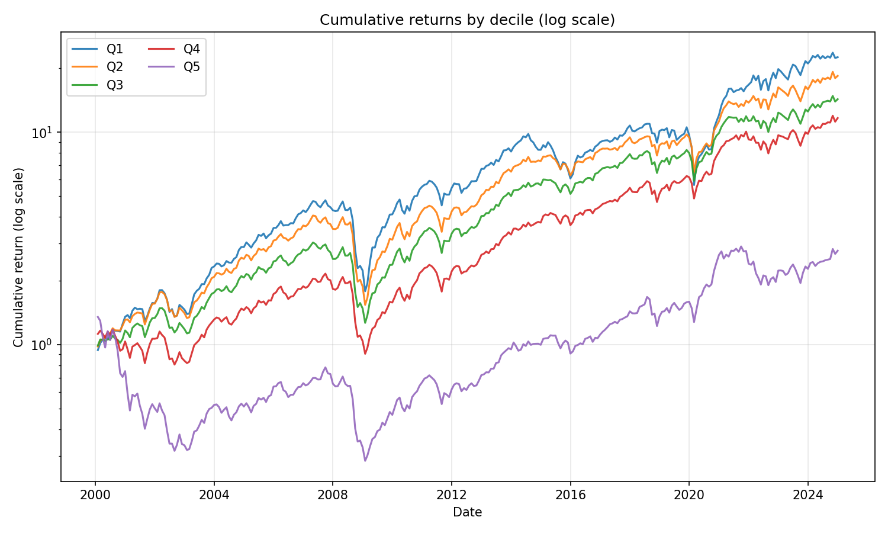
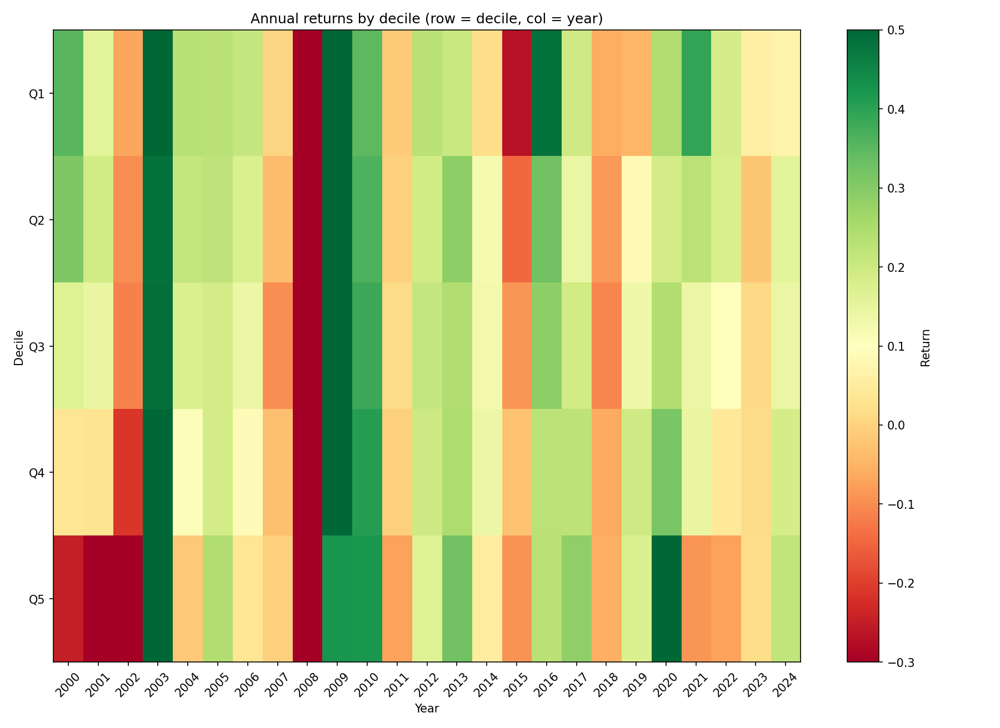
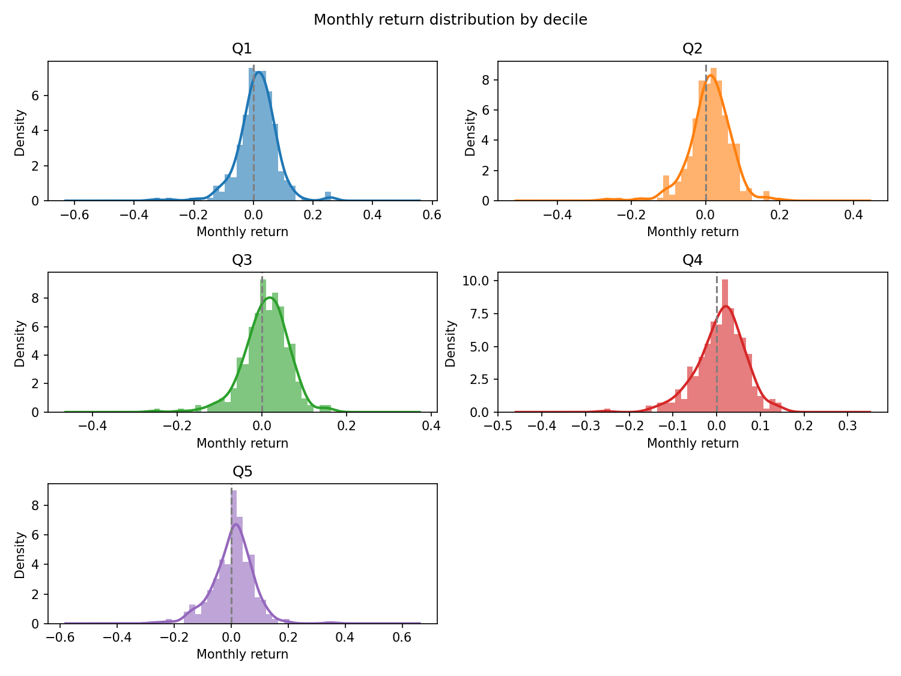
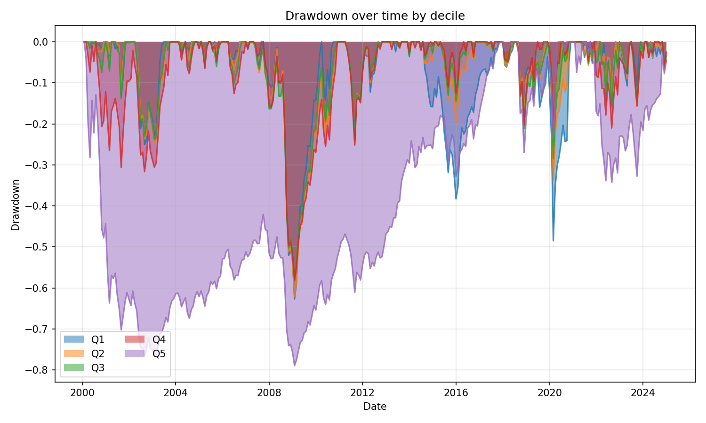
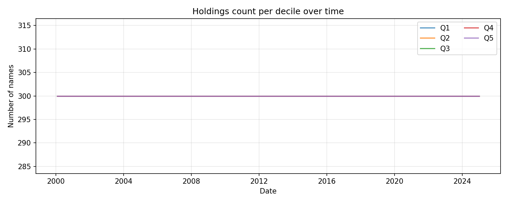
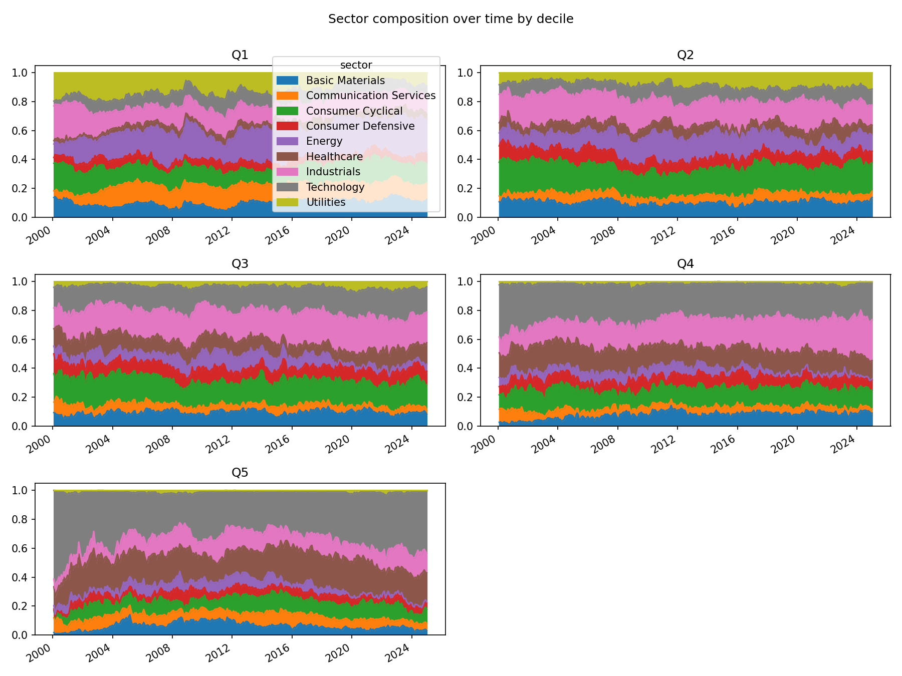
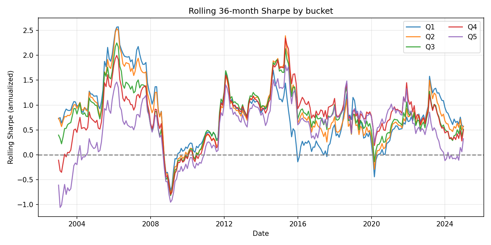
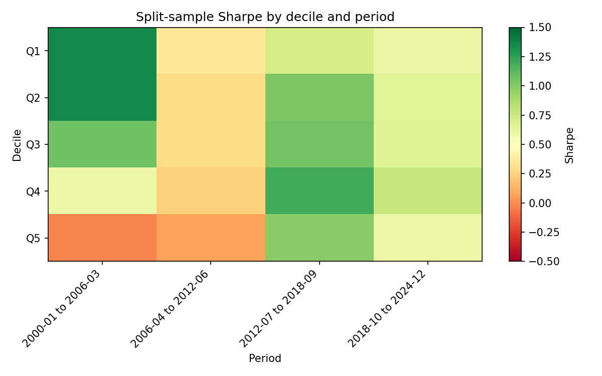

# Descriptive backtest report

**Run:** `0001_dreman_pcf_quintile`  
**Description:** Dreman-style P/CF quintiles only, top 1500, ex-Fin/RE, monthly  
**Date range:** 2000-01-31 00:00:00 to 2024-12-31 00:00:00  
**Buckets:** 5 (Q1 = cheapest, Q5 = most expensive)

---

## 1. Per-bucket summary

CAGR, annualized volatility, Sharpe, Sortino, max drawdown, and win rate (% of months with positive return).

| bucket | CAGR | ann_vol | Sharpe | Sortino | max_dd | win_rate_pct |
| --- | --- | --- | --- | --- | --- | --- |
| Q1 | 13.32% | 22.65% | 0.67 | 0.83 | -62.70% | 61.7% |
| Q2 | 12.40% | 19.58% | 0.70 | 0.86 | -62.03% | 61.3% |
| Q3 | 11.27% | 18.40% | 0.67 | 0.88 | -58.13% | 62.0% |
| Q4 | 10.36% | 19.19% | 0.61 | 0.82 | -58.05% | 61.3% |
| Q5 | 4.17% | 24.52% | 0.29 | 0.40 | -78.96% | 62.0% |

---

## 2. Cumulative equity curves (log scale)

Whether outperformance is steady or regime-dependent.



---

## 3. Annual returns heatmap

Bucket × year. Are mid-buckets consistently better or lumpy?



---

## 4. Monthly return distributions

KDE/histogram per bucket. Quality filter compressing the left tail in mid-buckets vs Q1 would show here. Skewness and kurtosis below.



**Skewness & kurtosis (monthly returns):**

| bucket | skewness | kurtosis | n_months |
| --- | --- | --- | --- |
| Q1 | -0.563 | 4.961 | 300 |
| Q2 | -0.824 | 3.771 | 300 |
| Q3 | -0.717 | 2.592 | 300 |
| Q4 | -0.650 | 1.727 | 300 |
| Q5 | -0.178 | 2.533 | 300 |

---

## 5. Drawdown curves

Peak-to-trough and recovery by bucket.



---

## 6. Holdings count per bucket over time

Check that no bucket is thin in certain periods (spurious results).



---

## 7. Sector composition per bucket

Stacked area: are certain buckets sector bets in disguise?



---

## 8. Rolling Sharpe (36-month window)

Signal stability over time rather than a single full-period number.



**Rolling Sharpe summary:**

| bucket | rolling_sharpe_mean | rolling_sharpe_min | rolling_sharpe_max | rolling_sharpe_std |
| --- | --- | --- | --- | --- |
| Q1 | 0.804 | -0.724 | 2.571 | 0.613 |
| Q2 | 0.835 | -0.775 | 2.536 | 0.595 |
| Q3 | 0.796 | -0.820 | 2.248 | 0.534 |
| Q4 | 0.778 | -0.797 | 2.348 | 0.540 |
| Q5 | 0.519 | -1.056 | 1.802 | 0.556 |

---

## 9. Split-sample (all deciles × multiple periods)

Sharpe by decile in each of 4 equal-length sub-periods over the full data range.



**Sharpe by decile and period (markdown table):**

| decile | 2000-01 to 2006-03 | 2006-04 to 2012-06 | 2012-07 to 2018-09 | 2018-10 to 2024-12 |
| --- | --- | --- | --- | --- |
| Q1 | 1.354 | 0.350 | 0.716 | 0.609 |
| Q2 | 1.355 | 0.284 | 1.025 | 0.655 |
| Q3 | 1.064 | 0.288 | 1.058 | 0.656 |
| Q4 | 0.598 | 0.234 | 1.195 | 0.770 |
| Q5 | -0.029 | 0.067 | 0.988 | 0.599 |

**Plain text (Sharpe by decile × period):**

```
        2000-01 to 2006-03  2006-04 to 2012-06  2012-07 to 2018-09  2018-10 to 2024-12
decile                                                                                
Q1                   1.354               0.350               0.716               0.609
Q2                   1.355               0.284               1.025               0.655
Q3                   1.064               0.288               1.058               0.656
Q4                   0.598               0.234               1.195               0.770
Q5                  -0.029               0.067               0.988               0.599
```
