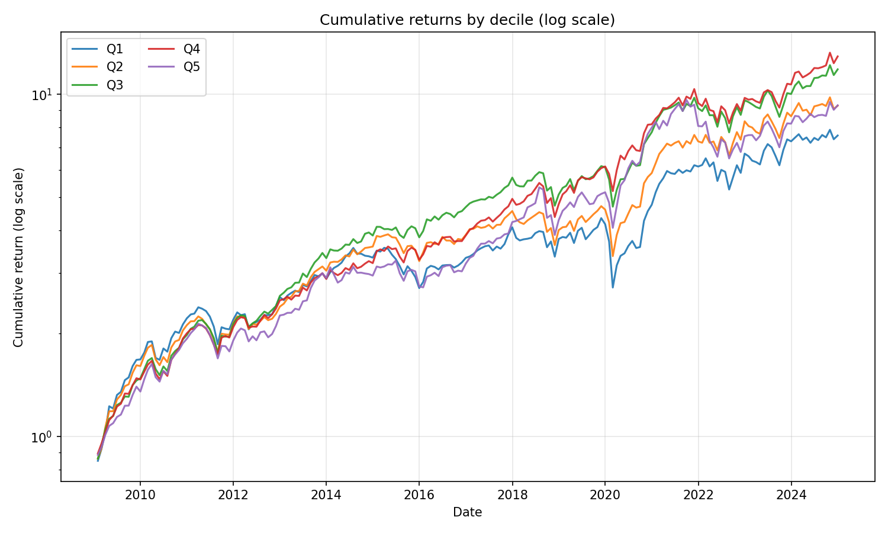
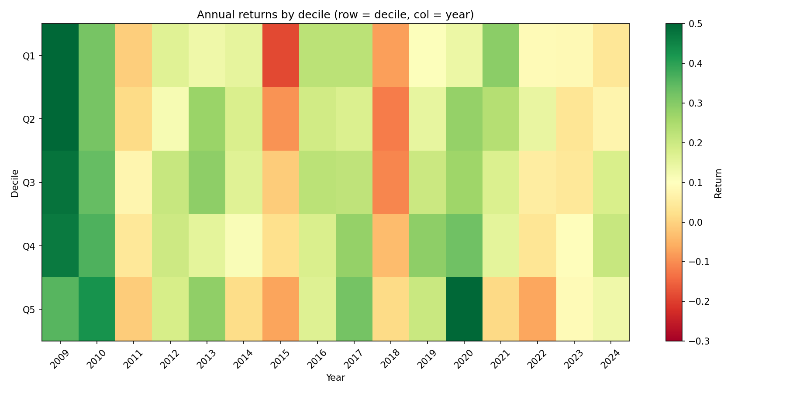
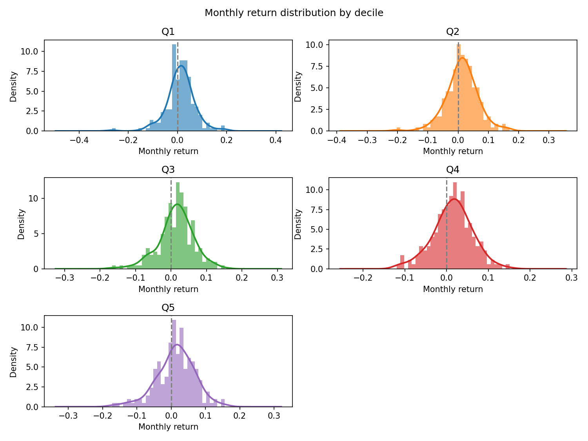
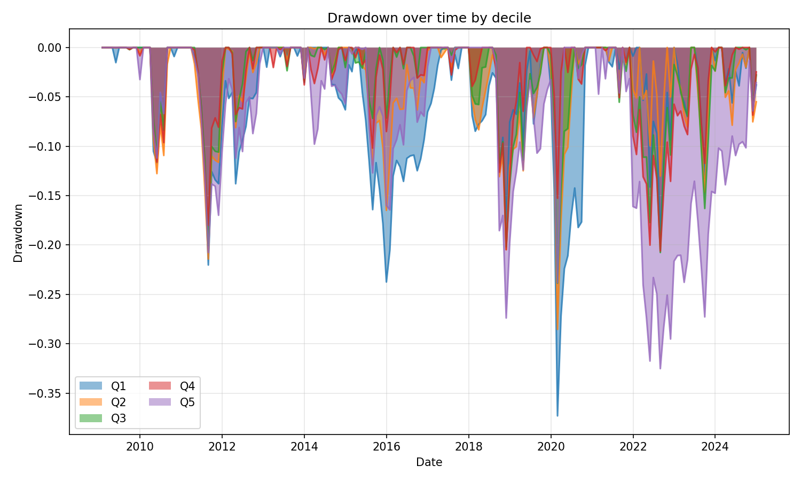
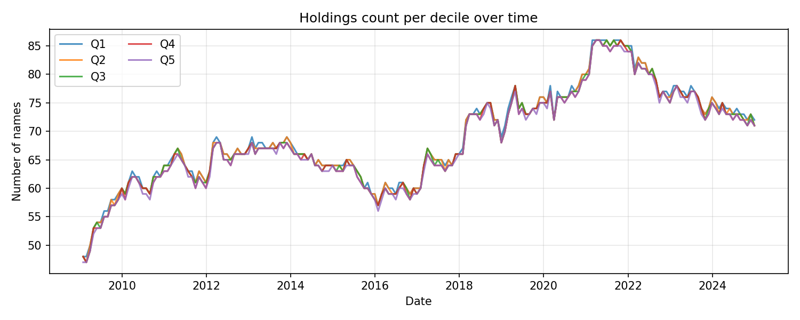
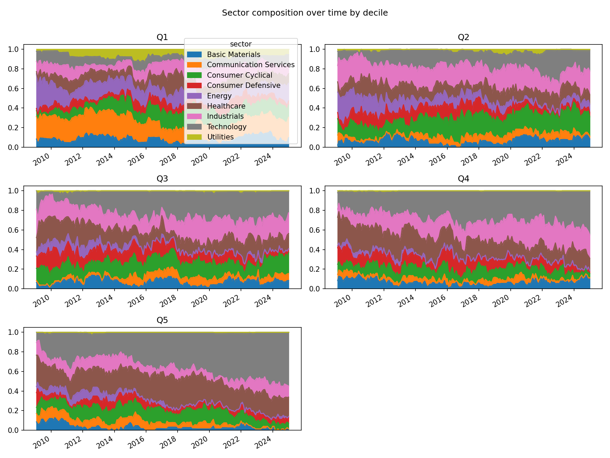
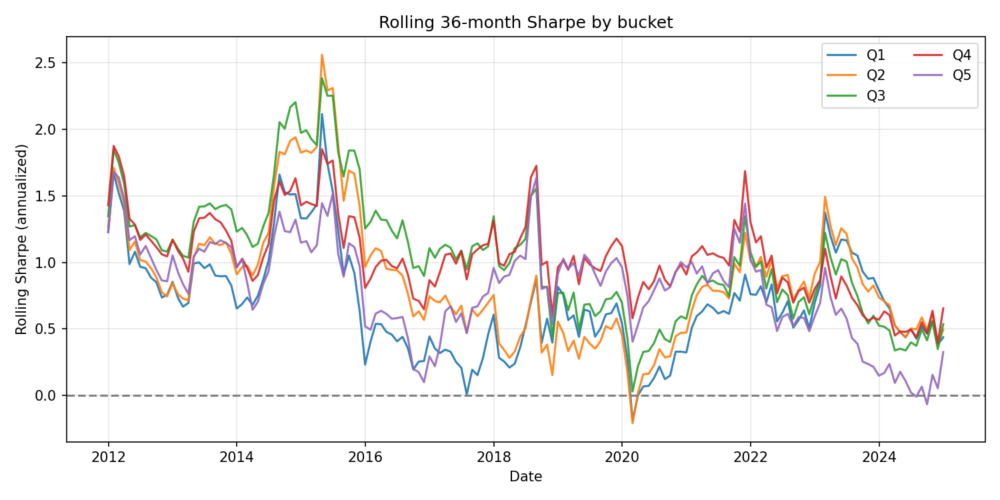
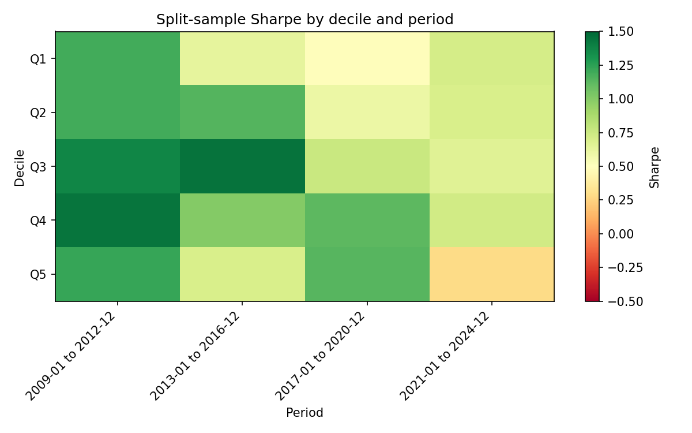

# Descriptive backtest report

**Run:** `0004_pcf_quality_quintile`  
**Description:** PCF decile sort + quality filter (fcf_r2>0.5, fcf_pct>=0.5), top 1500, ex-Fin/RE, monthly  
**Date range:** 2009-01-30 00:00:00 to 2024-12-31 00:00:00  
**Buckets:** 5 (Q1 = cheapest, Q5 = most expensive)

---

## 1. Per-bucket summary

CAGR, annualized volatility, Sharpe, Sortino, max drawdown, and win rate (% of months with positive return).

| bucket | CAGR | ann_vol | Sharpe | Sortino | max_dd | win_rate_pct |
| --- | --- | --- | --- | --- | --- | --- |
| Q1 | 13.57% | 19.79% | 0.74 | 0.98 | -37.30% | 60.9% |
| Q2 | 15.01% | 18.16% | 0.86 | 1.25 | -28.54% | 63.0% |
| Q3 | 16.79% | 17.06% | 1.00 | 1.36 | -23.86% | 65.6% |
| Q4 | 17.43% | 16.32% | 1.07 | 1.68 | -20.61% | 64.1% |
| Q5 | 15.03% | 19.04% | 0.83 | 1.18 | -32.52% | 65.1% |

---

## 2. Cumulative equity curves (log scale)

Whether outperformance is steady or regime-dependent.



---

## 3. Annual returns heatmap

Bucket × year. Are mid-buckets consistently better or lumpy?



---

## 4. Monthly return distributions

KDE/histogram per bucket. Quality filter compressing the left tail in mid-buckets vs Q1 would show here. Skewness and kurtosis below.



**Skewness & kurtosis (monthly returns):**

| bucket | skewness | kurtosis | n_months |
| --- | --- | --- | --- |
| Q1 | -0.468 | 3.349 | 192 |
| Q2 | -0.225 | 1.693 | 192 |
| Q3 | -0.452 | 1.132 | 192 |
| Q4 | -0.194 | 0.381 | 192 |
| Q5 | -0.442 | 0.831 | 192 |

---

## 5. Drawdown curves

Peak-to-trough and recovery by bucket.



---

## 6. Holdings count per bucket over time

Check that no bucket is thin in certain periods (spurious results).



---

## 7. Sector composition per bucket

Stacked area: are certain buckets sector bets in disguise?



---

## 8. Rolling Sharpe (36-month window)

Signal stability over time rather than a single full-period number.



**Rolling Sharpe summary:**

| bucket | rolling_sharpe_mean | rolling_sharpe_min | rolling_sharpe_max | rolling_sharpe_std |
| --- | --- | --- | --- | --- |
| Q1 | 0.697 | -0.190 | 2.115 | 0.395 |
| Q2 | 0.871 | -0.209 | 2.561 | 0.474 |
| Q3 | 1.040 | 0.030 | 2.384 | 0.471 |
| Q4 | 1.036 | 0.394 | 1.876 | 0.308 |
| Q5 | 0.803 | -0.066 | 1.680 | 0.367 |

---

## 9. Split-sample (all deciles × multiple periods)

Sharpe by decile in each of 4 equal-length sub-periods over the full data range.



**Sharpe by decile and period (markdown table):**

| decile | 2009-01 to 2012-12 | 2013-01 to 2016-12 | 2017-01 to 2020-12 | 2021-01 to 2024-12 |
| --- | --- | --- | --- | --- |
| Q1 | 1.191 | 0.632 | 0.489 | 0.712 |
| Q2 | 1.194 | 1.147 | 0.596 | 0.697 |
| Q3 | 1.374 | 1.447 | 0.759 | 0.660 |
| Q4 | 1.443 | 1.006 | 1.120 | 0.731 |
| Q5 | 1.223 | 0.701 | 1.140 | 0.283 |

**Plain text (Sharpe by decile × period):**

```
        2009-01 to 2012-12  2013-01 to 2016-12  2017-01 to 2020-12  2021-01 to 2024-12
decile                                                                                
Q1                   1.191               0.632               0.489               0.712
Q2                   1.194               1.147               0.596               0.697
Q3                   1.374               1.447               0.759               0.660
Q4                   1.443               1.006               1.120               0.731
Q5                   1.223               0.701               1.140               0.283
```
