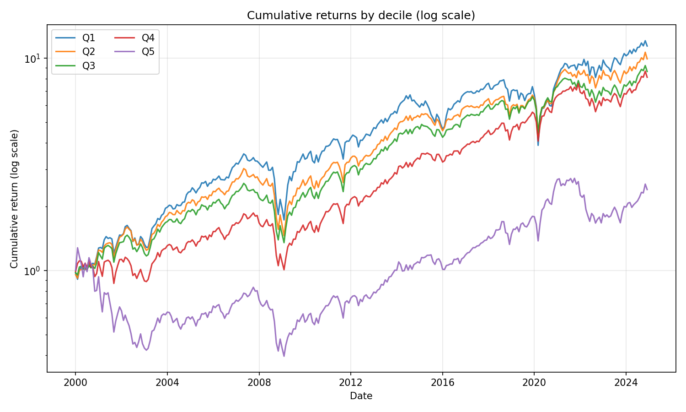
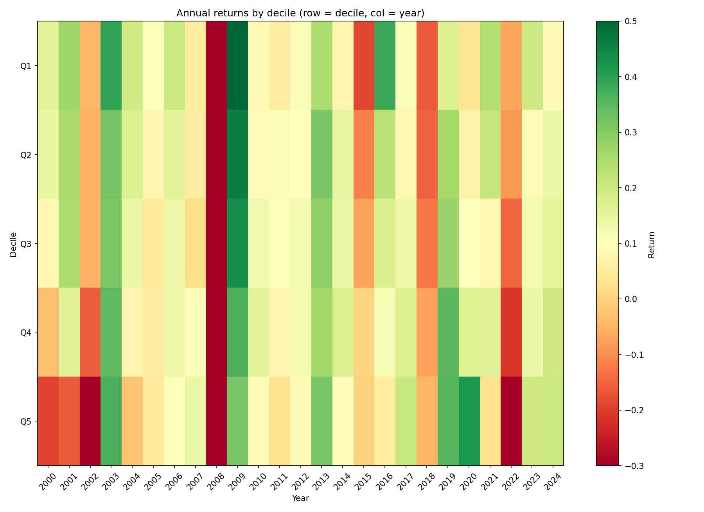
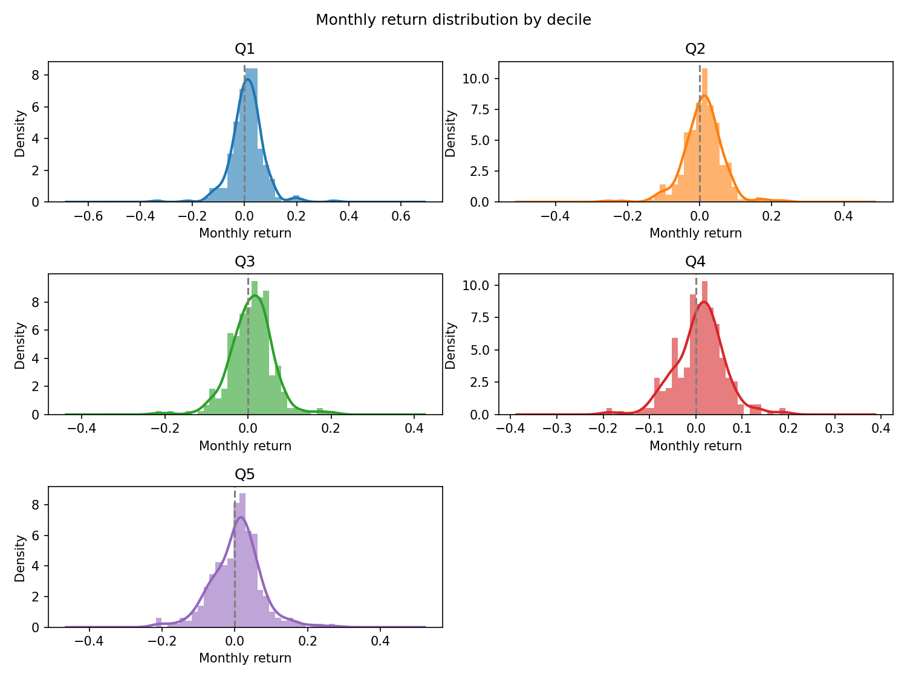
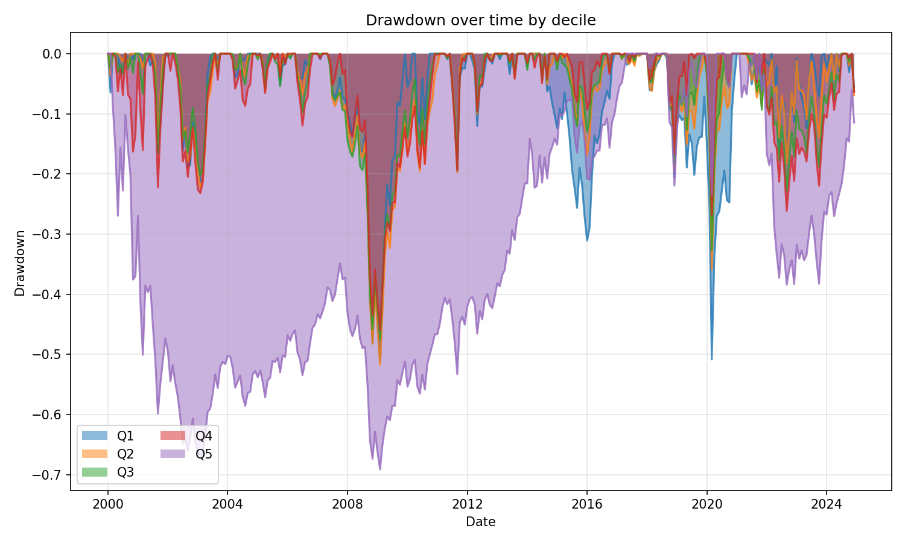
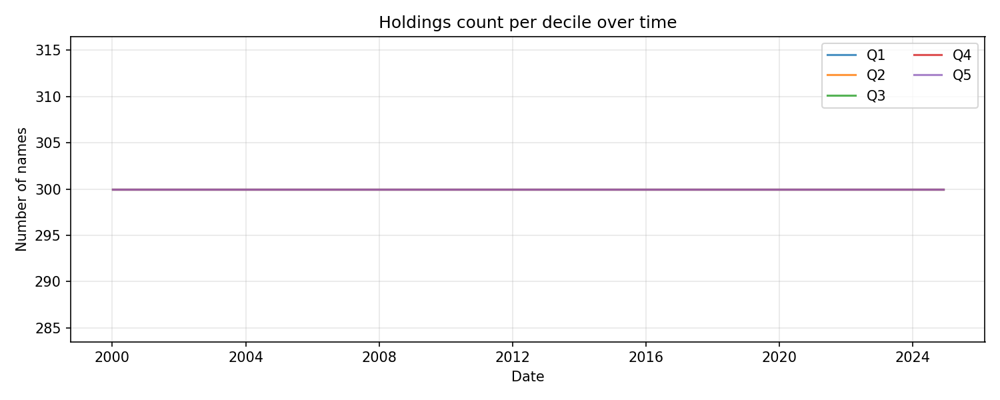
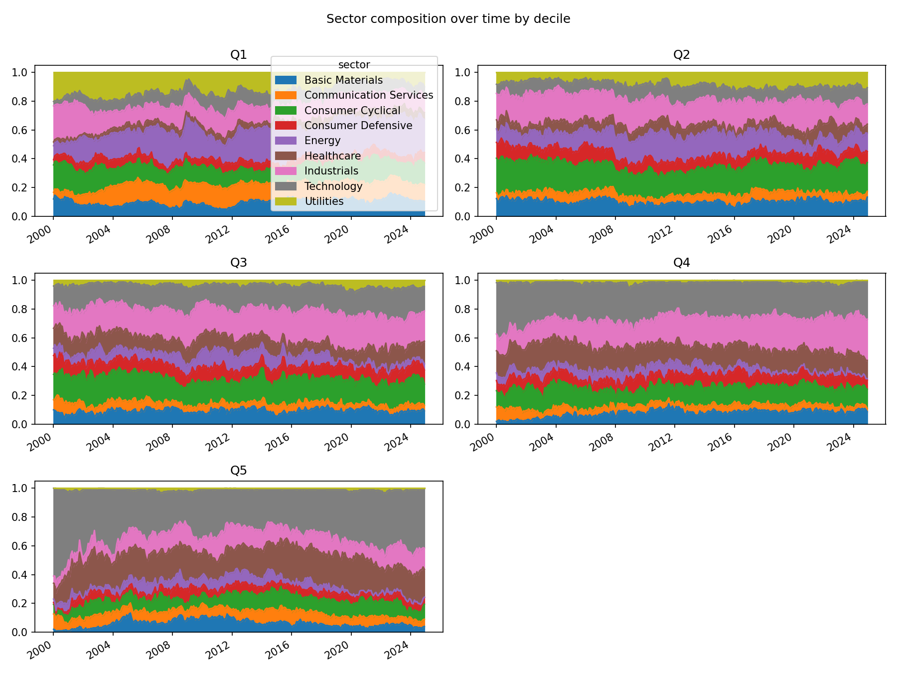
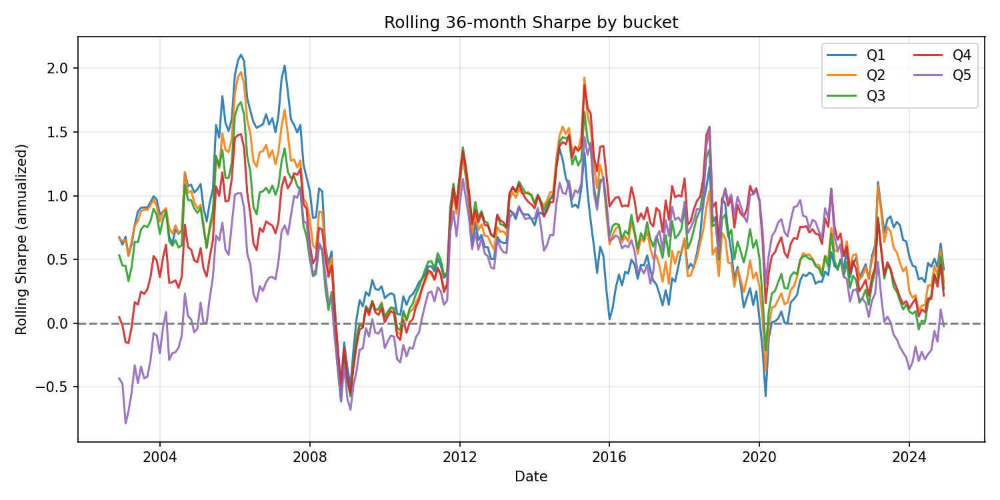
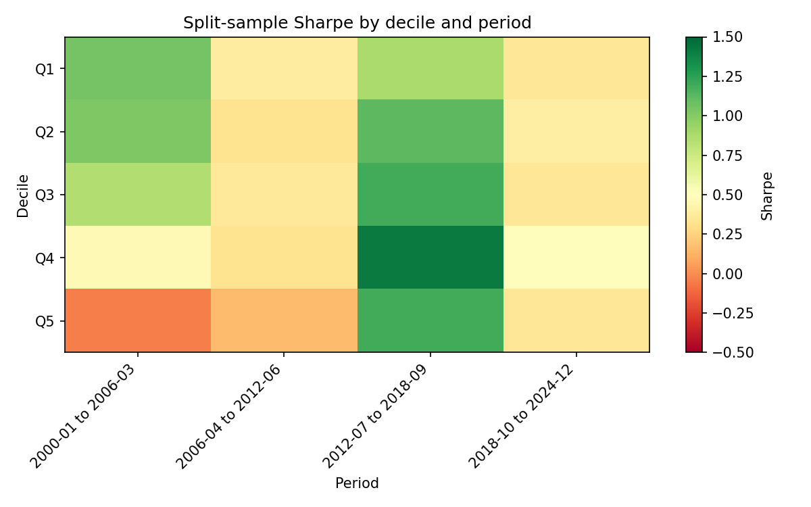

# Descriptive backtest report

**Run:** `pfcf_monthly`  
**Description:** Dreman-style P/CF quintiles only, top 1500, ex-Fin/RE, monthly rebalance  
**Date range:** 2000-01-03 00:00:00 to 2024-12-02 00:00:00  
**Buckets:** 5 (Q1 = cheapest, Q5 = most expensive)

---

## 1. Per-bucket summary

CAGR, annualized volatility, Sharpe, Sortino, max drawdown, and win rate (% of months with positive return).

| bucket | CAGR | ann_vol | Sharpe | Sortino | max_dd | win_rate_pct |
| --- | --- | --- | --- | --- | --- | --- |
| Q1 | 10.27% | 21.89% | 0.56 | 0.76 | -51.12% | 59.0% |
| Q2 | 9.65% | 19.07% | 0.58 | 0.79 | -51.73% | 60.0% |
| Q3 | 9.05% | 18.00% | 0.57 | 0.84 | -47.42% | 58.0% |
| Q4 | 8.78% | 18.50% | 0.55 | 0.79 | -45.96% | 60.7% |
| Q5 | 3.59% | 23.28% | 0.27 | 0.40 | -69.13% | 58.7% |

---

## 2. Cumulative equity curves (log scale)

Whether outperformance is steady or regime-dependent.



---

## 3. Annual returns heatmap

Bucket × year. Are mid-buckets consistently better or lumpy?



---

## 4. Monthly return distributions

KDE/histogram per bucket. Quality filter compressing the left tail in mid-buckets vs Q1 would show here. Skewness and kurtosis below.



**Skewness & kurtosis (monthly returns):**

| bucket | skewness | kurtosis | n_months |
| --- | --- | --- | --- |
| Q1 | -0.029 | 6.293 | 300 |
| Q2 | -0.221 | 3.822 | 300 |
| Q3 | -0.108 | 2.755 | 300 |
| Q4 | -0.156 | 1.698 | 300 |
| Q5 | 0.033 | 1.782 | 300 |

---

## 5. Drawdown curves

Peak-to-trough and recovery by bucket.



---

## 6. Holdings count per bucket over time

Check that no bucket is thin in certain periods (spurious results).



---

## 7. Sector composition per bucket

Stacked area: are certain buckets sector bets in disguise?



---

## 8. Rolling Sharpe (36-month window)

Signal stability over time rather than a single full-period number.



**Rolling Sharpe summary:**

| bucket | rolling_sharpe_mean | rolling_sharpe_min | rolling_sharpe_max | rolling_sharpe_std |
| --- | --- | --- | --- | --- |
| Q1 | 0.673 | -0.571 | 2.106 | 0.491 |
| Q2 | 0.681 | -0.573 | 1.970 | 0.466 |
| Q3 | 0.650 | -0.614 | 1.734 | 0.428 |
| Q4 | 0.666 | -0.546 | 1.870 | 0.437 |
| Q5 | 0.429 | -0.785 | 1.525 | 0.488 |

---

## 9. Split-sample (all deciles × multiple periods)

Sharpe by decile in each of 4 equal-length sub-periods over the full data range.



**Sharpe by decile and period (markdown table):**

| decile | 2000-01 to 2006-03 | 2006-04 to 2012-06 | 2012-07 to 2018-09 | 2018-10 to 2024-12 |
| --- | --- | --- | --- | --- |
| Q1 | 1.053 | 0.386 | 0.875 | 0.350 |
| Q2 | 1.017 | 0.326 | 1.122 | 0.395 |
| Q3 | 0.852 | 0.359 | 1.194 | 0.349 |
| Q4 | 0.463 | 0.328 | 1.418 | 0.491 |
| Q5 | -0.042 | 0.161 | 1.189 | 0.351 |

**Plain text (Sharpe by decile × period):**

```
        2000-01 to 2006-03  2006-04 to 2012-06  2012-07 to 2018-09  2018-10 to 2024-12
decile                                                                                
Q1                   1.053               0.386               0.875               0.350
Q2                   1.017               0.326               1.122               0.395
Q3                   0.852               0.359               1.194               0.349
Q4                   0.463               0.328               1.418               0.491
Q5                  -0.042               0.161               1.189               0.351
```
