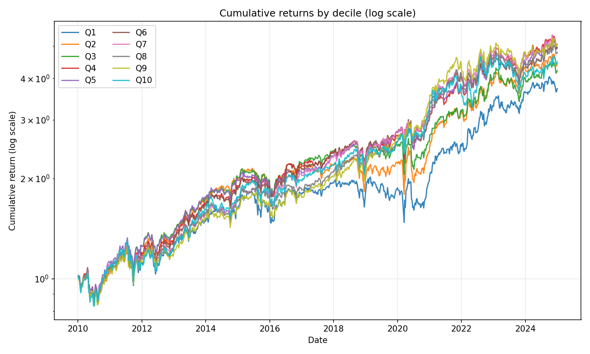
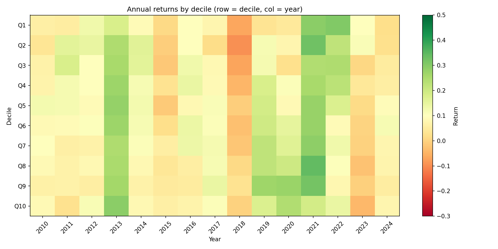
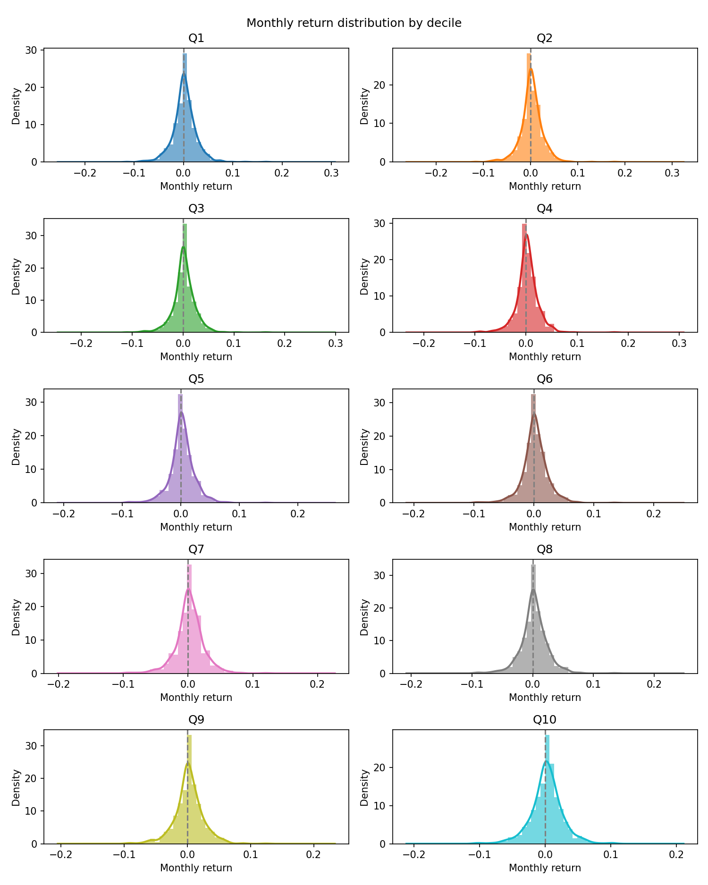
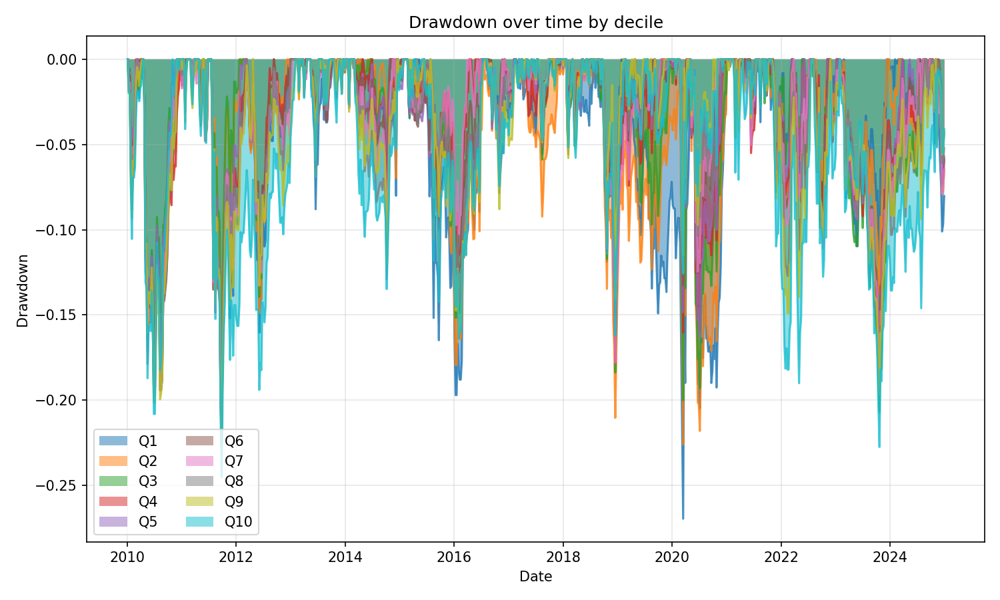
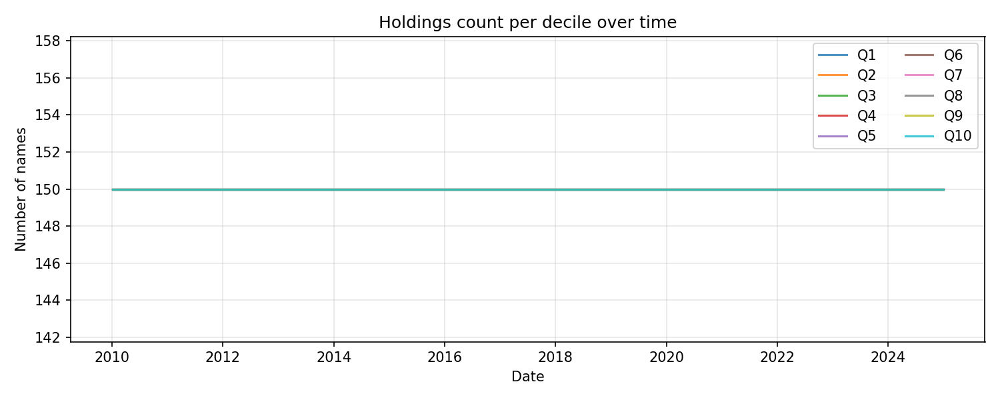
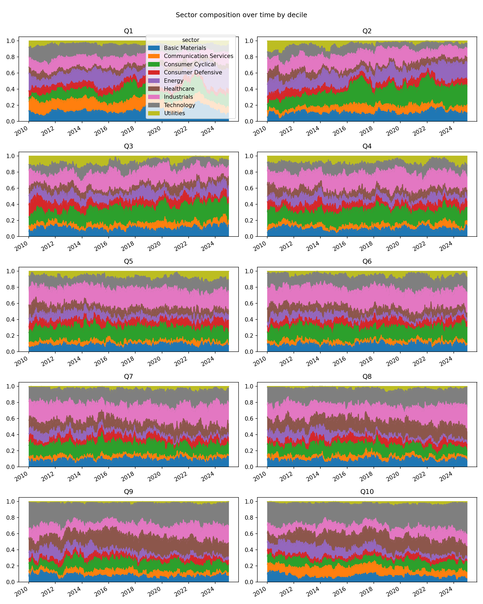
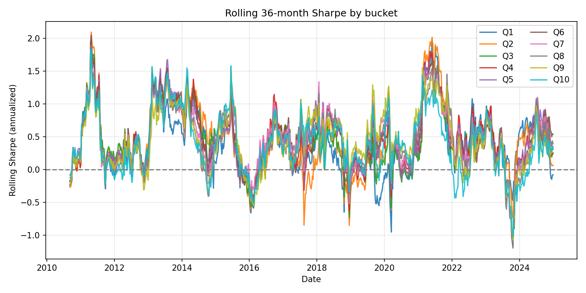
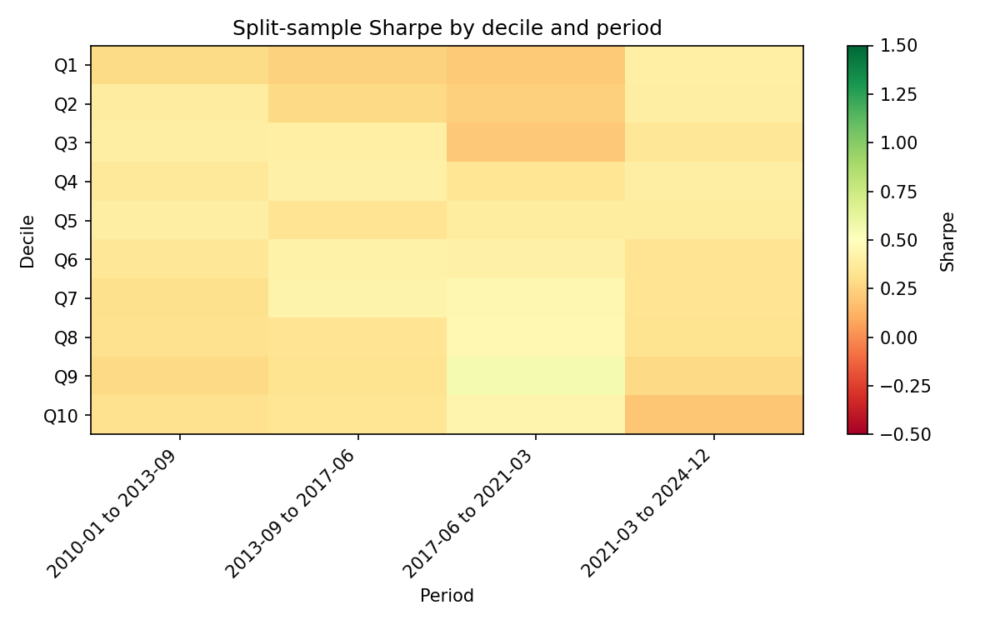

# Descriptive backtest report

**Run:** `pfcf_weekly`  
**Description:** Dreman-style P/CF quintiles only, top 1500, ex-Fin/RE, weekly rebalance  
**Date range:** 2010-01-04 00:00:00 to 2024-12-30 00:00:00  
**Buckets:** 10 (Q1 = cheapest, Q10 = most expensive)

---

## 1. Per-bucket summary

CAGR, annualized volatility, Sharpe, Sortino, max drawdown, and win rate (% of months with positive return).

| bucket | CAGR | ann_vol | Sharpe | Sortino | max_dd | win_rate_pct |
| --- | --- | --- | --- | --- | --- | --- |
| Q1 | 9.17% | 8.34% | 0.28 | 0.39 | -26.96% | 50.3% |
| Q2 | 10.43% | 8.27% | 0.32 | 0.43 | -22.61% | 50.2% |
| Q3 | 10.08% | 7.77% | 0.32 | 0.42 | -20.71% | 50.8% |
| Q4 | 11.43% | 7.59% | 0.37 | 0.48 | -22.49% | 52.0% |
| Q5 | 11.26% | 7.38% | 0.37 | 0.49 | -21.09% | 51.3% |
| Q6 | 11.27% | 7.33% | 0.37 | 0.49 | -22.49% | 52.4% |
| Q7 | 11.41% | 7.46% | 0.37 | 0.49 | -22.49% | 51.2% |
| Q8 | 11.01% | 7.55% | 0.36 | 0.48 | -21.36% | 52.1% |
| Q9 | 11.43% | 7.90% | 0.35 | 0.48 | -22.84% | 52.0% |
| Q10 | 10.52% | 8.50% | 0.31 | 0.43 | -24.52% | 51.5% |

---

## 2. Cumulative equity curves (log scale)

Whether outperformance is steady or regime-dependent.



---

## 3. Annual returns heatmap

Bucket × year. Are mid-buckets consistently better or lumpy?



---

## 4. Monthly return distributions

KDE/histogram per bucket. Quality filter compressing the left tail in mid-buckets vs Q1 would show here. Skewness and kurtosis below.



**Skewness & kurtosis (monthly returns):**

| bucket | skewness | kurtosis | n_months |
| --- | --- | --- | --- |
| Q1 | 0.308 | 5.235 | 783 |
| Q2 | 0.271 | 6.257 | 783 |
| Q3 | 0.104 | 5.814 | 783 |
| Q4 | 0.227 | 6.891 | 783 |
| Q5 | 0.080 | 4.636 | 783 |
| Q6 | -0.066 | 4.214 | 783 |
| Q7 | -0.141 | 3.228 | 783 |
| Q8 | -0.043 | 3.557 | 783 |
| Q9 | -0.082 | 2.780 | 783 |
| Q10 | -0.150 | 2.538 | 783 |

---

## 5. Drawdown curves

Peak-to-trough and recovery by bucket.



---

## 6. Holdings count per bucket over time

Check that no bucket is thin in certain periods (spurious results).



---

## 7. Sector composition per bucket

Stacked area: are certain buckets sector bets in disguise?



---

## 8. Rolling Sharpe (36-month window)

Signal stability over time rather than a single full-period number.



**Rolling Sharpe summary:**

| bucket | rolling_sharpe_mean | rolling_sharpe_min | rolling_sharpe_max | rolling_sharpe_std |
| --- | --- | --- | --- | --- |
| Q1 | 0.391 | -0.953 | 2.032 | 0.487 |
| Q2 | 0.437 | -0.852 | 2.093 | 0.517 |
| Q3 | 0.441 | -1.165 | 1.951 | 0.476 |
| Q4 | 0.492 | -1.161 | 1.975 | 0.472 |
| Q5 | 0.481 | -1.108 | 1.878 | 0.469 |
| Q6 | 0.485 | -1.125 | 2.047 | 0.472 |
| Q7 | 0.480 | -1.124 | 1.892 | 0.442 |
| Q8 | 0.448 | -1.196 | 1.897 | 0.464 |
| Q9 | 0.446 | -1.075 | 1.734 | 0.440 |
| Q10 | 0.401 | -1.025 | 1.833 | 0.455 |

---

## 9. Split-sample (all deciles × multiple periods)

Sharpe by decile in each of 4 equal-length sub-periods over the full data range.



**Sharpe by decile and period (markdown table):**

| decile | 2010-01 to 2013-09 | 2013-09 to 2017-06 | 2017-06 to 2021-03 | 2021-03 to 2024-12 |
| --- | --- | --- | --- | --- |
| Q1 | 0.287 | 0.247 | 0.212 | 0.406 |
| Q2 | 0.387 | 0.275 | 0.235 | 0.392 |
| Q3 | 0.392 | 0.399 | 0.203 | 0.344 |
| Q4 | 0.360 | 0.407 | 0.341 | 0.392 |
| Q5 | 0.392 | 0.332 | 0.376 | 0.382 |
| Q6 | 0.346 | 0.421 | 0.414 | 0.333 |
| Q7 | 0.309 | 0.427 | 0.447 | 0.335 |
| Q8 | 0.317 | 0.329 | 0.457 | 0.325 |
| Q9 | 0.281 | 0.323 | 0.553 | 0.275 |
| Q10 | 0.313 | 0.338 | 0.432 | 0.202 |

**Plain text (Sharpe by decile × period):**

```
        2010-01 to 2013-09  2013-09 to 2017-06  2017-06 to 2021-03  2021-03 to 2024-12
decile                                                                                
Q1                   0.287               0.247               0.212               0.406
Q2                   0.387               0.275               0.235               0.392
Q3                   0.392               0.399               0.203               0.344
Q4                   0.360               0.407               0.341               0.392
Q5                   0.392               0.332               0.376               0.382
Q6                   0.346               0.421               0.414               0.333
Q7                   0.309               0.427               0.447               0.335
Q8                   0.317               0.329               0.457               0.325
Q9                   0.281               0.323               0.553               0.275
Q10                  0.313               0.338               0.432               0.202
```
