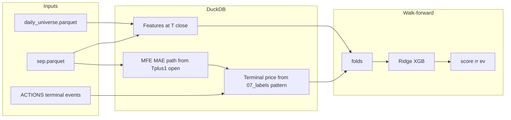

# Implement `experiments/qullamaggie.py` from the docstring (revised)

## Context and constraints

- **Universe**: `[config.DAILY_UNIVERSE_PATH](config.py)` → `daily_universe.parquet`: `in_universe = TRUE`, `date >= 2015-01-01`.
- **Prices**: SEP via `_sep_path()` (see `[experiments/momentum.py](experiments/momentum.py)`).
- **Timing**: Features at **T** use only data through **T**’s close. **Entry** for labels and PnL = **next bar’s open** (`LEAD(open)` on ticker-ordered dates). Do not use master `fwd_ret_`* from `[pipeline/07_labels.py](pipeline/07_labels.py)` as-is (those are close→close from **T**).
- **Walk-forward**: `[get_rebal_dates](walkforward/folds.py)` + `[generate_folds](walkforward/folds.py)`; custom fold SQL like `[experiments/walk_forward_daily.py](experiments/walk_forward_daily.py)`. Default **month-end** + `periods_per_year=12` in `[evaluate_fold](walkforward/evaluation.py)`.
- **ATR vs ADR (clarified)**:
  - **ATR %**: volatility-style measure as **fraction of price** (e.g. Wilder ATR / `closeadj`), used to **normalize realized MFE and MAE only** (targets), not to blanket-scale every feature.
  - **ADR**: **average daily range in price units** — e.g. `AVG(high - low)` over N ∈ {5,10,20} bars. It is **not** inherently a percentage; do not label ADR as “ADR %”. If a dimensionless range measure is needed for analysis, define a **separate** column (e.g. `(high-low)/close` daily then averaged) and name it explicitly.

## Phase 1 — Feature panel (DuckDB)

1. **Grid** + **SEP** + `sep_ranked` (`rn`), with lookback buffer before `min(grid.date)` (252+ for 52w and 50d MA).
2. **Complete checklist** from `[experiments/qullamaggie.py](experiments/qullamaggie.py)` (do not drop items):
  - **Returns**: 1m / 3m / 6m → **21 / 63 / 126** trading-day `closeadj` returns; also **5 / 10 / 20**-bar returns where the doc calls for those windows.
  - **ADR**: `adr_N = AVG(high - low)` over N ∈ {5,10,20} (dollars).
  - **ATR %**: e.g. 14d Wilder ATR / `closeadj` (or align with `[pipeline/03_price_features.py](pipeline/03_price_features.py)`).
  - **SMAs**: 10 / 20 / 50; **distance from each** = `close / sma - 1` (use `closeadj` consistently).
  - **52w**: rolling **252 td** max/min on `closeadj`; **distance from 52w high** and **distance from 52w low** (both explicit — plan previously under-specified low).
  - **Slope of log returns** (21 / 63 / 126): e.g. OLS slope of `LN(closeadj/LAG(closeadj))` over window, or documented proxy.
  - **Pullback**: `pullback_pct_N = (rolling_max_N - close) / rolling_max_N` for **each** N ∈ {5,10,20}.
  - **days_since_high_N**: bars since last date `close` (or `closeadj`) equaled `rolling_max_N` — per N or document if a single N is used first.
  - **dist_to_high_N** = `(rolling_max_N - close) / close` for each N.
  - **Range contraction**: `range_N = (rolling_max_N - rolling_min_N) / rolling_mean_N(close)` for N ∈ {5,10,20}; **range_5 / range_20** ratio.
  - **Tight closes**: share of last N days where `ABS(closeadj - LAG(closeadj)) < threshold * atr_14` (or fixed tick threshold — document).
  - **Volume contraction**: `vol_5d / vol_20d` (mean volume).
  - **Slope of volume** over 20d (log volume regression slope).
3. **Do not** apply ATR/ADR normalization across the feature vector; keep features in natural units / ratios as defined above.

## Phase 2 — Labels, terminal events, and ranking/PnL columns

Mirror `**[pipeline/07_labels.py](pipeline/07_labels.py)`** for delisting and last observable price:

- Load **ACTIONS**; build `**terminal_events_resolved`** (and related views: delist dates, reasons, rename exclusion) **as in 07_labels** — same SQL blocks so behavior matches the pipeline.
- Extend `**sep_ranked`** (or parallel table) to include **open, high, low, closeadj** for forward windows starting at **entry_rn = rn_T + 1** with **entry_open = open** on that bar.
- **Forward path** over **H** trading days (default H=21): aggregate running max of `high`, min of `low` relative to `entry_open` for **mfe_pct**, **mae_pct** (same definitions as before).
- **Truncation / delist**: When the full H-day path is not available, follow the **terminal_row** pattern: join to last available **SEP** row for that ticker (`term_closeadj` at `term_rn`), and use `**terminal_events_resolved`** on `term_date` for `fwd_delisted` / `fwd_delist_type` semantics (exclude **mergerfrom** from delist flag where 07_labels does). Use terminal **closeadj** (or last tradeable close) to finalize **exit** for PnL and, where appropriate, to cap the forward window for MFE/MAE so economics match reality.
- **ATR normalization (targets only)**: Let `atr_pct_T` = ATR% as of signal close **T**. Store e.g. `mfe_atr = mfe_pct / NULLIF(atr_pct_T,0)`, `mae_atr = mae_pct / NULLIF(atr_pct_T,0)` (and/or divide by ADR in **dollars** if you want a second normalization — name columns clearly). **Train** Ridge/XGB on these normalized targets (or raw + sample weights — pick one and stick to it).

**Panel must include columns for ranking and P&L (not only mfe/mae):**

| Column group                                                                      | Purpose                                                                                                                                                                                                                                                                                                                  |
| --------------------------------------------------------------------------------- | ------------------------------------------------------------------------------------------------------------------------------------------------------------------------------------------------------------------------------------------------------------------------------------------------------------------------ |
| **Realized path**                                                                 | `mfe_pct`, `mae_pct`; optional `mfe_atr`, `mae_atr`                                                                                                                                                                                                                                                                      |
| **Period PnL**                                                                    | `fwd_ret_entry_open_H` = `(exit_price / entry_open) - 1` with `exit_price` = `closeadj` at **T+H** when available, else **terminal** close per 07_labels (same branching as `labels_N`); plus `fwd_holding_days`, `fwd_delisted`, `fwd_delist_type` mirroring 07_labels where applicable                                 |
| **Realized ranking scores** (doc analogs, for analysis / optional direct targets) | `score_realized = mfe_pct - alpha * mae_pct` (mae as positive pain); `rr_realized = mfe_pct / NULLIF(mae_pct,0)`; **EV**: `ev_realized = p_up * mfe_pct - p_down * mae_pct` only once **p_up/p_down** are defined (e.g. second stage: binary model or calibrated probs) — otherwise leave NULL or omit until probs exist |
| **Predicted ranking scores** (after model, per fold OOS + full-series export)     | `mfe_pred`, `mae_pred`; `score_pred = mfe_pred - alpha * abs(mae_pred)`; `rr_pred = mfe_pred / NULLIF(abs(mae_pred),0)`; `ev_pred` when `p_up_pred`, `p_down_pred` exist                                                                                                                                                 |

Portfolio evaluation and Sharpe should use `**fwd_ret_entry_open_H`** (or the chosen exit rule) as `ret_col`, not an unrelated close→close label.

## Phase 3 — Walk-forward + models

- Full scoring contract: **Phase 3b** (model diagnostics, decile lift, portfolio + trade stats).
- Folds + custom loader unchanged in spirit from prior plan.
- Fit **two** regressors (Ridge + XGB) per target on **IS** (`mfe_atr`, `mae_atr` recommended).
- On **OOS**, append `**score_pred`**, `**rr_pred`**, (optional `**ev_pred**`), then rank / top decile.
- `evaluate_fold`: decile wrapper or dynamic `top_n`; pass `periods_per_year=12` for monthly.

## Phase 3b — Model & portfolio scoring (evaluation contract)

**Principle:** The model’s job is **ranking**; the backtest’s job is **money**. Do **not** optimize or over-weight **MSE** / mean **MAE** of regressors — use them only as sanity checks. Prioritize **correlation**, **rank IC**, **decile lift**, then **portfolio** outcomes.

### 1. Model metrics (diagnostics only)

Computed on **OOS** rows per fold (and optionally pooled OOS with fold labels to avoid double-counting bias — document choice). Use the same target scale you trained on (e.g. `mfe_atr` / `mae_atr` **or** raw `mfe_pct` / `mae_pct`) consistently when reporting.

| Metric                   | Definition                                                | Notes                                                                           |
| ------------------------ | --------------------------------------------------------- | ------------------------------------------------------------------------------- |
| **Pearson corr**         | `corr(y_true, y_pred)` separately for **MFE** and **MAE** | More important than MSE for “is signal there?”                                  |
| **Rank IC**              | `spearman_corr(y_true, y_pred)` per **MFE** and **MAE**   | Primary ordering metric; robust to outliers; aligned with trading               |
| **MSE / mean abs error** | Standard regression losses                                | **Lowest priority**; debugging / sanity only — **do not** select models on this |

**Reporting:** For each model (Ridge, XGB), each target, print/store: Pearson ρ, Spearman ρ (rank IC). Optional: time-series of **cross-sectional** Spearman per `date` then mean/median IC (common quant convention).

### 2. Decile (bucket) lift — model ↔ realized outcomes

Within each **OOS date**, rank names by `**score_pred`** (or by `mfe_pred` alone for ablations). Assign **deciles** (10% buckets). Pool all OOS observations and aggregate:

- **Avg realized MFE** (and/or `mfe_atr`) per decile
- **Avg realized MAE** per decile
- **Avg realized `fwd_ret_entry_open_H`** per decile

**Success pattern:** Monotonic-ish improvement from bottom → top decile on **return** and **MFE**; **MAE** ideally **lower** in top deciles (“pain filtering”). One summary table: decile × (avg MFE, avg MAE, avg return, count).

### 3. Portfolio metrics (what matters economically)

**Simulation (v1):** Fixed horizon already in `fwd_ret_entry_open_H`; **equal-weight** top **X%** (decile, 20%, 10%) **per rebalance date**; compound **period** returns in time order.

| Bucket                                                           | Metrics                                                                                                                                                                                               |
| ---------------------------------------------------------------- | ----------------------------------------------------------------------------------------------------------------------------------------------------------------------------------------------------- |
| **Return**                                                       | CAGR (stitch OOS period returns — reuse `[oos_drawdown_and_cagr](walkforward/evaluation.py)` from `walkforward` with `periods_per_year=12` for monthly), mean period return, **median** period return |
| **Risk**                                                         | Max drawdown, vol of period returns (annualized), **Sharpe** (already in `evaluate_fold`)                                                                                                             |
| **Trade-level** (expand each period into **constituent** trades) | Win rate (% trades with `fwd_ret_entry_open_H > 0`), **avg win / avg loss** (separate means on wins vs losses), **expectancy** E = w \cdot \bar{r}*{win} - (1-w) \cdot \bar{r}*{loss}                 |
| **Selection quality**                                            | Table: **All** names vs **top 20%** vs **top 10%** by `score_pred` — avg **period** return (and optionally avg trade return) to show edge                                                             |
| **Capacity / turnover**                                          | Trades per year (or per month × names), avg names selected per date, simple turnover proxy = mean churn of tickers between consecutive rebalance dates                                                |

**Rough benchmarks (intuition, not gates):** Rank IC ~**0.05–0.15** can be useful; top decile clearly beating universe is strong; Sharpe **> 1** on OOS stitched series is strong; smooth equity = good (plot cumulative from stitched period returns).

### 4. Setup-specific diagnostics (MFE / MAE)

| Check                                                     | Definition                                                                                                                              |
| --------------------------------------------------------- | --------------------------------------------------------------------------------------------------------------------------------------- |
| **Predicted vs actual RR**                                | `rr_actual = mfe_pct / NULLIF(mae_pct,0)`, `rr_pred = mfe_pred / NULLIF(abs(mae_pred),0)` — report Pearson/Spearman between them on OOS |
| **Pain filtering**                                        | Mean **realized MAE** (or `mae_atr`) in **top** vs **bottom** prediction deciles — good models **cut** tail risk in the top bucket      |
| **Speed / early capture (optional, multi-horizon later)** | If you add shorter H: compare how quickly MFE is realized (e.g. MFE captured in first k days) — defer until multi-horizon exists        |

### 5. Per-fold evaluation workflow (build this in code)

For **each** model variant (Ridge / XGB) and each walk-forward fold:

1. **Regression diagnostics (OOS):** Pearson corr (MFE, MAE), Spearman rank IC (MFE, MAE); MSE only logged.
2. **Bucket analysis:** Deciles of `score_pred` → avg MFE, MAE, `fwd_ret_entry_open_H` + monotonicity eyeball.
3. **Trading simulation:** Top decile (and top 20%) equal-weight portfolio → series of period returns.
4. **Portfolio stats:** Sharpe, max DD, CAGR on that series; trade-level win rate, avg win/loss, expectancy; turnover / names per period.

Then **aggregate across folds:** mean/median fold Sharpe, distribution of rank IC, stitched **full OOS** equity / CAGR / max DD (concatenate non-overlapping OOS periods per rolling WF design).

### 6. Implementation reuse

- `[evaluate_fold](walkforward/evaluation.py)` → Sharpe, period returns, selection counts for a given `top_n` / decile policy.
- `[oos_drawdown_and_cagr](walkforward/evaluation.py)` → max DD, CAGR from stitched period return series.
- New small helpers in `experiments/qullamaggie.py` (or `experiments/qullamaggie_metrics.py` if it grows): `cross_sectional_decile_lift(df, score_col, ...)`, `trade_level_stats(df, ret_col)`, `ic_by_date(df)`.

### 7. Explicit non-goals

- Do **not** pick hyperparameters by **minimum MSE** alone.
- Do **not** treat in-sample R² as success — always report **OOS** diagnostics above.

## Phase 4 — Polish

- CLI, sanity checks, optional fold cache.

## Files to touch

- Primary: `[experiments/qullamaggie.py](experiments/qullamaggie.py)`.
- Reference: `[pipeline/07_labels.py](pipeline/07_labels.py)` (ACTIONS + `terminal_events_resolved` + `terminal_row` + label assembly), `[experiments/momentum.py](experiments/momentum.py)`, `[walkforward/*](walkforward/)`.

## Defaults to pin in code

| Choice                    | Default                                       |
| ------------------------- | --------------------------------------------- |
| Fold calendar             | Month-end from panel                          |
| H (MFE/MAE / PnL horizon) | 21 trading days                               |
| Target for ML             | `mfe_atr`, `mae_atr` (ATR as of T close)      |
| Primary rank score        | `score_pred = mfe_pred - 0.5 * abs(mae_pred)` |
| PnL / backtest return     | `fwd_ret_entry_open_H` (terminal-aware)       |
| Selection                 | Top decile by `score_pred` per date           |

